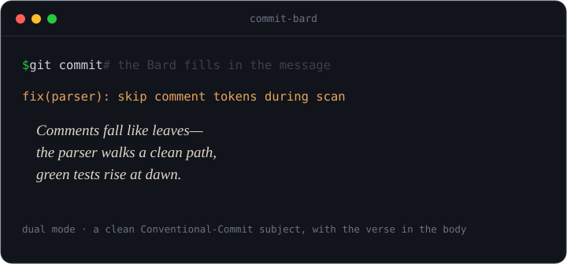

# Git Commit Bard

*Your staged diff, returned as verse. The commit message as a tiny creative artifact.*

[](https://github.com/Lonkins/commit-bard/actions/workflows/tests.yml)



Git Commit Bard reads your staged diff and writes the commit message with
literary flair — haiku, sea shanty, limerick, epic verse, ballad, pirate,
corporate-buzzword, noir. Whimsy is opt-in. It runs with **zero setup** in an
offline mock mode, and calls a real model the moment you add an API key.

> **Status: alpha.** Working today: the CLI, the default **dual mode** (a clean
> Conventional-Commit subject line with the verse in the body), the
> `prepare-commit-msg` **git hook**, a repo **"wrapped"** digest (Markdown or a
> standalone HTML gallery), and a **GitHub Action** that versifies PRs. Not yet
> on PyPI.

## Try it in 30 seconds

No API key required — it runs in a charming offline mock mode out of the box.

> Not on PyPI yet — `pipx install commit-bard` lands with the first release;
> for now clone and install from source.

```bash
git clone https://github.com/Lonkins/commit-bard
cd commit-bard
python3 -m pip install -e .          # or: pipx install .

commit-bard --sample --style shanty  # a sea shanty about a bundled sample diff
commit-bard --list-styles            # see all the styles
commit-bard --sample 3               # three styles side by side (great screenshot)
```

A taste — one haiku `commit-bard --sample --style haiku` might print (the mock
corpus rotates, so you'll get a different verse each run):

```
Comments fall like leaves—
the parser walks a clean path,
green tests rise at dawn.
```

## Real diffs, real models

Stage some changes and pick a style. With no key it stays in mock mode; drop a
key in and the **same command** calls a real model and versifies *your* diff:

```bash
git add -p
export ANTHROPIC_API_KEY=sk-...      # or OPENAI_API_KEY=...
commit-bard --style noir             # a hard-boiled verse about what you staged
```

The artifact goes to **stdout** (pipe-clean), so you can wire it straight in:

```bash
git commit -m "$(commit-bard --style limerick)"
```

## Modes

```bash
commit-bard --mode dual    # subject line + verse in the body (the default)
commit-bard --mode verse   # just the verse
commit-bard --mode plain   # a conventional subject line only, no verse
```

**Dual** keeps it useful: a clean `type(scope): summary` line your team can read
at a glance, with the verse tucked underneath. Offline (or if a model reply
can't be parsed) the subject is synthesized from the diff's shape, so you always
get a committable message.

## Install the git hook

Wire it into `git commit` so every commit *can* be versified — with an easy
escape hatch. The hook **never blocks a commit**: on any error or timeout it
falls back to a plain message (or leaves yours untouched), and always exits 0.

```bash
commit-bard install-hook      # writes a prepare-commit-msg hook (backs up any existing one)
git commit                    # opens your editor with a dual message prefilled

BARD_SKIP=1 git commit        # skip the Bard for one commit
commit-bard uninstall-hook    # remove it (restores your backup)
```

It leaves merges, squashes, amends, and `-m`/`-F` commits alone, and is aware of
`core.hooksPath` (Husky/pre-commit).

## Repo "wrapped"

Look back at your repo's commit poems and collect the best into a shareable
digest — your repo, in verse.

```bash
commit-bard wrapped                       # Markdown digest of the top poems
commit-bard wrapped --top 20 --since v1.0 # tune the range and count
commit-bard wrapped --format html > poems.html   # a standalone gallery page
```

By default it reads `git log` and pulls the verse out of dual-mode commits — no
extra setup required. The HTML output is a self-contained page (open it, or
publish it to GitHub Pages as a gallery).

**Optional poem history.** Turn on `[bard] history = true` (or
`COMMIT_BARD_HISTORY=1`) and each generated message is appended as one JSON line
to `.git/commit-bard/history.jsonl` — local to your clone, never committed.
It's **off by default** for privacy. When present, `wrapped` prefers this exact
record over reconstructing from `git log` (a `--since` range still uses git
log). Pass `--no-history` to skip recording a single run.

## GitHub Action

[`.github/workflows/commit-bard.yml`](.github/workflows/commit-bard.yml)
versifies each pull request's diff and posts it to the run summary. It works on
forks with no secrets (falls back to offline mock mode) and never fails the
check. Add `ANTHROPIC_API_KEY` (or `OPENAI_API_KEY`) as a repo secret for
diff-aware verse. It uses `--diff-file`, which reads a diff from a file or stdin
so you can wire the Bard into any pipeline:

```bash
git diff origin/main...HEAD | commit-bard --diff-file - --mode dual
```

## Providers & configuration

Configured entirely by environment variables. **Auto-detect:** no key → mock;
one key → it just works.

| Variable | Meaning | Default |
|---|---|---|
| `COMMIT_BARD_PROVIDER` | `anthropic` \| `openai-compatible` \| `ollama` \| `mock` | auto-detect → `mock` |
| `COMMIT_BARD_MODEL` | model name override | per-provider default (illustrative) |
| `COMMIT_BARD_API_KEY` | generic API key | — |
| `COMMIT_BARD_BASE_URL` | base URL override (proxies, gateways, self-host) | per-provider default |
| `ANTHROPIC_API_KEY` / `OPENAI_API_KEY` | honored as fallbacks; presence drives auto-detect | — |

- **`openai-compatible` covers a lot:** OpenAI itself, any OpenAI-compatible
  gateway/proxy, and local **Ollama** (`COMMIT_BARD_PROVIDER=ollama`,
  base URL `http://localhost:11434/v1`).
- **Model defaults are illustrative and change often** — always overridable via
  `COMMIT_BARD_MODEL`. Don't treat the built-in defaults as authoritative.
- **API keys are read from the environment only**, never written to a config
  file.

### Config file (optional)

Set non-secret defaults in a TOML file — `~/.config/commit-bard/config.toml`
(user) or `.commit-bard.toml` at the repo root (repo overrides user). Env vars
and CLI flags still override both. Resolution order: defaults → user → repo →
env → flags. **Never put API keys here.**

```toml
[bard]
style = "shanty"
mode  = "dual"          # dual | verse | plain
max_diff_chars = 6000   # big diffs are summarized past this budget
history = false         # opt-in: log generated poems to .git/commit-bard/

[hook]
on_error  = "plain"     # "plain" | "skip" — the hook never blocks a commit
timeout_s = 12
```

## Privacy — read this

Versifying with a **real provider sends your staged diff to that provider** —
the same reality as every AI-commit tool. Be deliberate about it:

- **Mock mode sends nothing** and is the default with no key.
- For local-only verse, point it at **Ollama** so nothing leaves your machine.
- The diff can contain secrets; we can't reliably scrub them. Prefer mock/local
  when in doubt, and never auto-run this in CI without explicit opt-in.

## Prior art & honest positioning

AI-generated commit messages are a mature, crowded space, and Git Commit Bard
does **not** claim to have invented the pipeline. Credit where it's due:

- [**aicommits**](https://github.com/Nutlope/aicommits) — popular, clean, fast.
- [**opencommit**](https://github.com/di-sukharev/opencommit) — multi-provider; GitHub 2023 Hackathon winner.
- [**aicommit2**](https://github.com/tak-bro/aicommit2) — multi-provider, multiple candidates.

The whole `diff → LLM → message` flow (multi-provider, git hook) is well-trodden
and not novel. **Git Commit Bard is a joy layer on top of a solved problem.**
What's ours: treating the commit as a deliberate literary/genre artifact, a
playful-yet-useful dual mode, and a delight layer (a repo "wrapped" of your best
commit poems, a shareable gallery) around it. We win on charm and taste, not on
inventing the plumbing.

## Development

```bash
python3 -m venv .venv && source .venv/bin/activate
pip install -e ".[dev]"
pytest                                # fully offline; no key, no network
```

Stdlib only at runtime (Python 3.9+) — the provider calls use `urllib`, so
`pipx install` stays instant and the offline demo needs nothing.

## License

[MIT](LICENSE).
